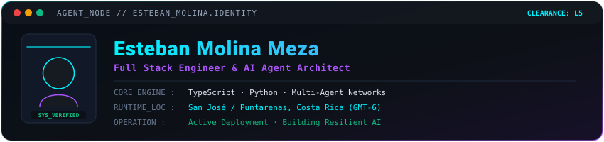

  

  

  
  &nbsp;
  
  &nbsp;
  

 

  

  Soy Esteban Molina, Ingeniero Full Stack especializado en <b>Inteligencia Artificial</b>, <b>TypeScript</b> y <b>Sistemas Multi-Agente</b>. 
  Diseño arquitecturas escalables, flujos de automatización resilientes y software de alto rendimiento.

  
  &nbsp;
  
  &nbsp;
  

 

  

   
  

 

  

  
  &nbsp;
  
  &nbsp;
  

  

  

---

<h3 align="center"><code>$ ./PROJECTS</code></h3>

  &nbsp;&nbsp;
  

  &nbsp;&nbsp;
  

---

<h3 align="center"><code>$ ./CONNECT</code></h3>

  &nbsp;&nbsp;
  &nbsp;&nbsp;
  

  <code>esmoliname@github:~$ system.ready --verbose ✔</code>

